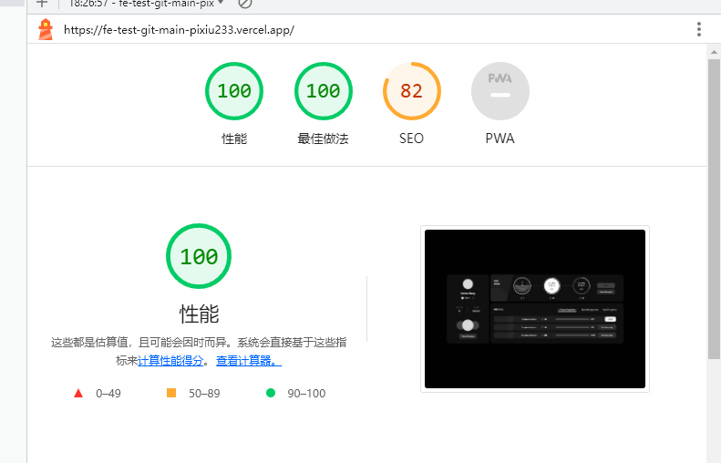
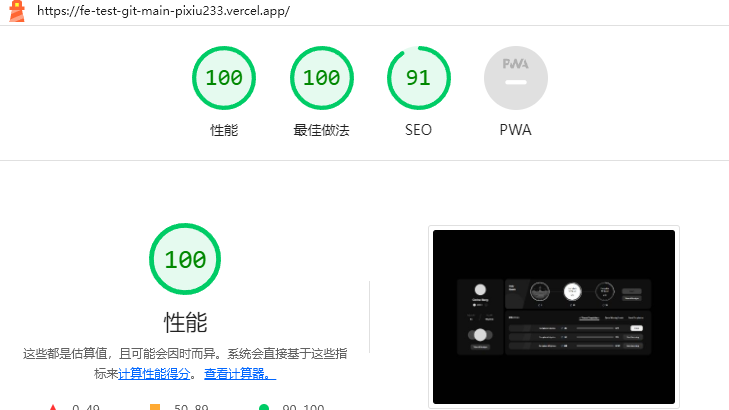

# Next.js + Tailwind CSS + 宋斯凯

<div align="center">
  <h2>🔋 FE-TEST</h2>


</div>

## Features
线上环境：https://fe-test-pixiu233.vercel.app

使用最新- ⚡️ Next.js 13 with App Router

1. 像素级还原UI设计稿。

2. 用fetch通过api路由获取本地mock数据

3. 组件化思想进行拆分业务组件，完成了Button,List,RadialProgress,Progress,Tab等组件的抽象复用。

4. Tab和按钮的可交互效果。

5. Tailwind  theme等配置。

6. Vercel自动化配置部署。

TODO:异步请求首页会导致屏闪问题//已解决

ques1:如何解决加载数据有延迟导致css闪烁的问题,如何提高用户体验

anw:使用 suspense boundary分解渲染工作。
```bash
 <Suspense fallback={<div>Loading...</div>}>
        <Albums promise={albumData} />
</Suspense>
```

ques2:报错了React Gets First Class Support for Async/Await
anw:用客户端渲染解决。

ques3:又报错了。fetch找不到接口404，但是浏览器可以正常请求。
anw:用全路径。and 配置base_url针对dev和开发环境。

ques4:切换tab导致每次都要重新发请求，要减少请求次数减少服务器压力。
ans:因为传入参数导致每次react渲染。用context跨级传递参数。

ques5:无限fetch的情况，issue上很多人都遇到了。。。。
ans:用cache

ques6:报错了。。。Error: Not implemented.
ans: 官方bug。。。next13的问题 https://github.com/vercel/next.js/issues/42180
最后用了memoize解决

完美解决！


### 0. LightHouse
Before code optimization



After code optimization

 优化锚点可供抓取，搜索引擎可能会使用链接中的 href 属性来抓取网站,设置nofollow告诉浏览器不要爬取传递权重。


 
This repository is 🔋 battery packed with:

- ⚡️ Next.js 13 with App Router
- ⚛️ React 18
- ✨ TypeScript
- 💨 Tailwind CSS 3 — Configured with CSS Variables to extend the **primary** color
- 💎 Pre-built Components — Components that will **automatically adapt** with your brand color, [check here for the demo](https://tsnext-tw.thcl.dev/components)
- 🃏 Jest — Configured for unit testing
- 📈 Absolute Import and Path Alias — Import components using `@/` prefix
- 📏 ESLint — Find and fix problems in your code, also will **auto sort** your imports
- 💖 Prettier — Format your code consistently
- 🐶 Husky & Lint Staged — Run scripts on your staged files before they are committed
- 🤖 Conventional Commit Lint — Make sure you & your teammates follow conventional commit
- ⏰ Release Please — Generate your changelog by activating the `release-please` workflow
- 👷 Github Actions — Lint your code on PR
- 🚘 Automatic Branch and Issue Autolink — Branch will be automatically created on issue **assign**, and auto linked on PR
- 🔥 Snippets — A collection of useful snippets
- 👀 Open Graph Helper Function — Awesome open graph generated using [og](https://github.com/theodorusclarence/og), fork it and deploy!
- 🗺 Site Map — Automatically generate sitemap.xml
- 📦 Expansion Pack — Easily install common libraries, additional components, and configs.

See the 👉 [feature details and changelog](https://github.com/theodorusclarence/ts-nextjs-tailwind-starter/blob/main/CHANGELOG.md) 👈 for more.

You can also check all of the **details and demos** on my blog post:

- [One-stop Starter to Maximize Efficiency on Next.js & Tailwind CSS Projects](https://theodorusclarence.com/blog/one-stop-starter)

## Getting Started

### 1. Clone this template using one of the three ways:

1. Use this repository 
```bash
   gite clone https://github.com/pixiu233/FE_TEST.git
```
 


2. Deploy to Vercel

   [](https://vercel.com/new/git/external?repository-url=https%3A%2F%2Fgithub.com%2Ftheodorusclarence%2Fts-nextjs-tailwind-starter)

### 2. Install dependencies

It is encouraged to use **yarn** so the husky hooks can work properly.

```bash
yarn install
```

### 3. Run the development server

You can start the server using this command:

```bash
yarn dev
```

Open [http://localhost:3000](http://localhost:3000) with your browser to see the result. You can start editing the page by modifying `src/pages/index.tsx`.

### 4. Change defaults

There are some things you need to change including title, urls, favicons, etc.

Find all comments with !STARTERCONF, then follow the guide.

Don't forget to change the package name in package.json

### 5. Commit Message Convention

This starter is using [conventional commits](https://www.conventionalcommits.org/en/v1.0.0/), it is mandatory to use it to commit changes.


### App Router Update

Due to App Router update, the expansion pack is currently **outdated**. It will be updated in the future. You can still use them by copy and pasting the files.
